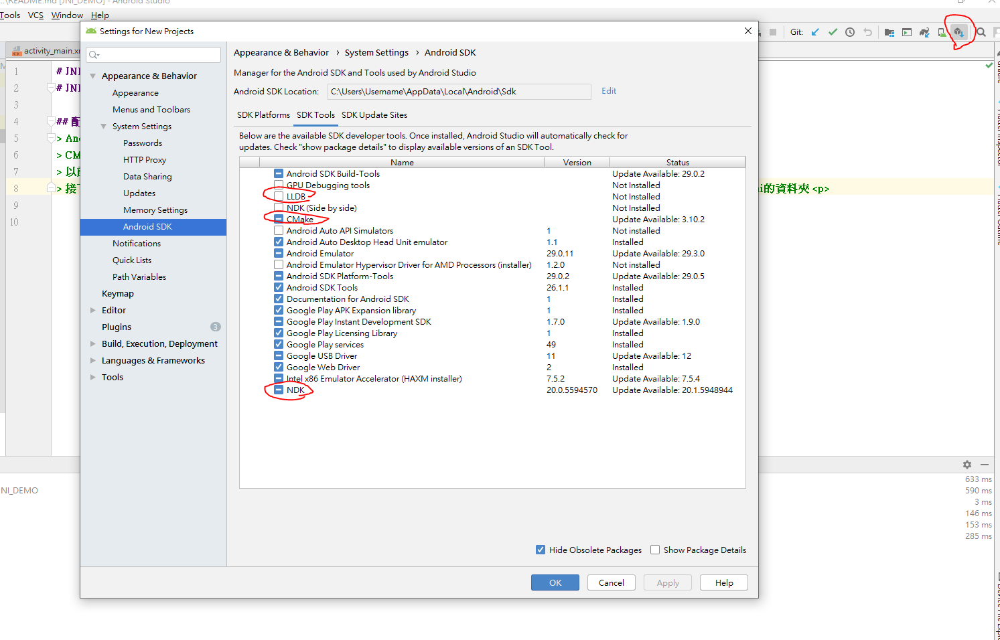
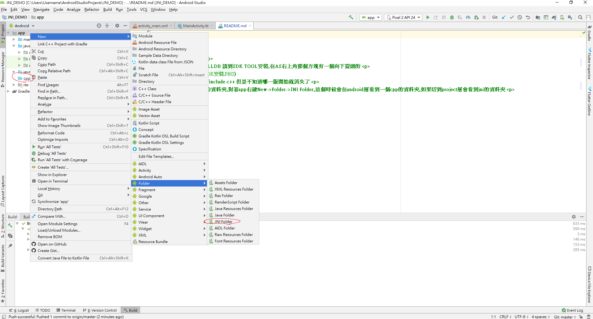
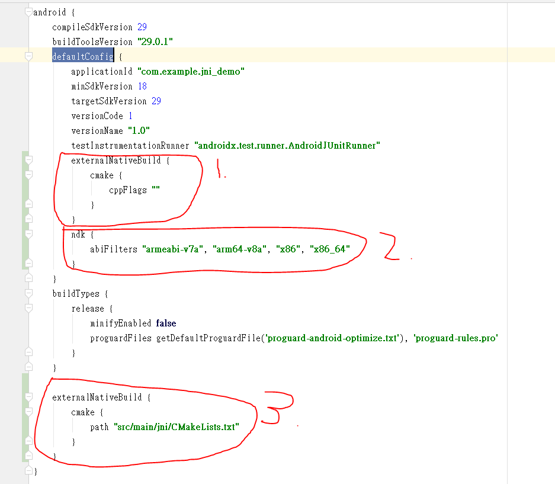
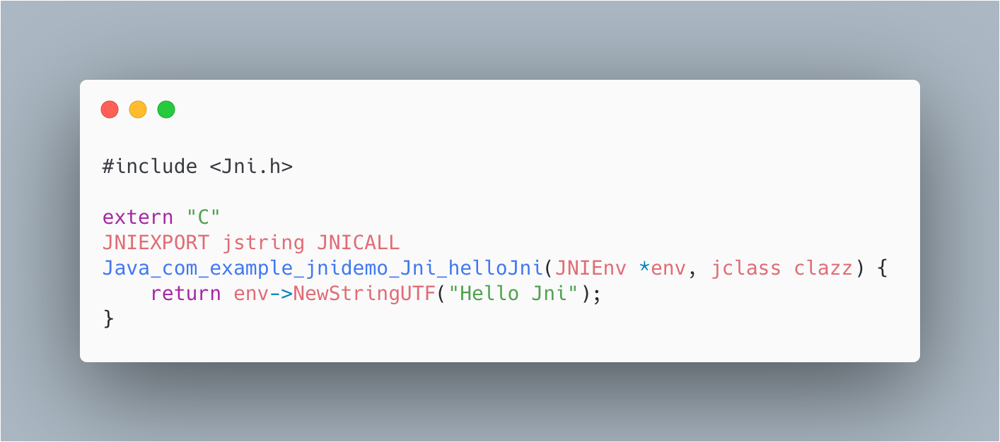

# JNI入門介紹與配置

## 配置篇
> 1.Android Studio 3.5 

> 2.CMAKE,NDK(20.0),LLDB 請到SDK TOOL安裝,在AS右上角那個方塊有一個向下箭頭的 

> 3.以前在New Project有include c++ 但是不知道哪一版開始就消失了 

> 4.接下來New一個JNI的資料夾,對著app右鍵New->Folder->JNI Folder,這個時候會在android層看到一個cpp的資料夾,如果切到project層會看到jni的資料夾 

> 5.在專案裡面配置NDK,File->Project Structure->SDK Location就會看到NDK Location這時候點▼應該就會看到NDK的位置了
這裡有另外一種配置法,在Gradle Scripts裡面有local.properties(SDK Location)寫入sdk.dir=C\:\\Users\\Username\\AppData\\Local\\Android\\Sdk(這個主要是你的NDK的位置)
> 6.對著cpp(jni)資料夾右鍵New一個File名稱叫做CMakeLists.txt，正常來說你就會看到一個三角形的CMakeLists.txt，詳細請直接去看檔案比較快，不過配置就不多說了因為不會，詳細請自行Google

> 7.接著切到Project層然後對著jni->New-> C/C++ Source File 名字隨便取這裡我是取native-lib，這個名稱你會在CMakeLists.txt看到

> 8.接著在build.gradle(Module:app)配置一些東西

第一點是配置cmake的一些參數，這個沒有配置好像也沒有關係，如果有什麼特殊需求的話應該這裡就會配置一些東西，如果有用到請自行Google，因為我也不會

第二點ndk的配置，這個正常來說你沒配置也沒關係，但是這裡解釋為何要這樣配置，NDK一共有這七種的指令集arm64-v8a、armeabi、armeabi-v7a、mips、mips64、x86、x86_64 
但是當NDK好像到了那一版的時候mips、mips64、armeabi就不支援了，至於原因自己上網Google，所以這行的配置的意思是只幫我生產出arm64-v8a、armeabi-v7a、x86、x86_64 
的so檔就好，我們寫好的C最後就會被編譯成 .so檔，你可以自己release一個apk然後把它解壓縮就會看到在lib的資料夾下有你的so檔了，window要解壓縮的話就是把 .apk改成 .zip就可 
mac的話則是要用cmd先cd到apk的資料夾然後下unzip APK檔案名稱.apk，然後就自動解壓縮了 
如果不配置這行會發生什麼事情?NDK預設是全部輸出所以如果你解壓縮你的APK之後在lib的資料夾下會看到七個資料夾，但是剛剛上述棄用的那三種指令集的資料夾並不會有so檔 
那這會造成什麼情況?假如有一支手機是mips64的，那當他要去載入你的so檔時，他會找不到so檔而導致直接閃退，在這裡特別的是他會先從資料夾開始找，如果沒有這個mips64的資料夾 
那他好像會先找armeabi-v7a的資料夾，詳細先找哪個我忘記了，簡單來說就是如果有這個名稱的資料夾他就會找這個資料夾，如果沒有這個資料夾他則會去找其他她有支援的資料夾

第三點很簡單就是配置CMakeLists.txt的路徑，這裡要看Project層的路徑為準"src/main/jni/CMakeLists.txt"，所以不是"src/main/cpp/CMakeLists.txt"

> 9.接著new一個Jni.java或Jni.kt的class，名稱不一定要叫做Jni，接著我們隨便需告一個方法，public static native String helloJni();，這裡關鍵就是native這個關鍵字這代表這是一個JNI的方法

> 10.接著到native-lib宣告對應的方法，首先#include <Jni.h>接著來說明一下宣告方法 
 
> #include **<Jni.h> 這個一定要引入** 
> extern "C"  **原因忘了自己Google** 
> JNIEXPORT jstring JNICALL  **(JNIEXPORT JNICALL這兩個都是固定這樣寫,jstring則是要回傳給JAVA的型別,型別後面會有圖片說明)** 
> Java_com_example_jnidemo_Jni_helloJni(JNIEnv *env, jclass clazz) { 
>    return env->NewStringUTF("Hello Jni"); 
> } 
> 需告方法名稱開頭**Java**這個是固定的,**com_example_jnidemo_Jni**這個是你放Jni.java或Jni.kt的包名＋Class名稱,最後就是宣告的方法名稱 
> (JNIEnv *env, jclass clazz)是系統預設導入的,不導入也沒關係 
> return env->NewStringUTF("Hello Jni"); 回傳一個jstring的字串,後面會說明 

> 11.接著在MainActivity宣告 
***  companion object{
        init {
            System.loadLibrary("native-lib")
        }
    } ***

