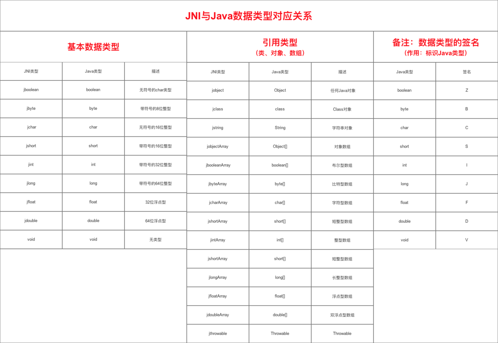
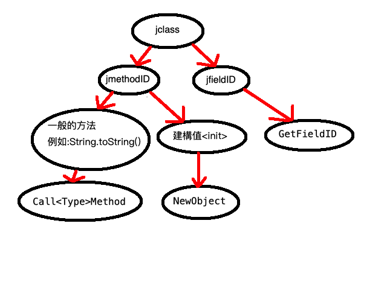

# JNI入門介紹與配置

## 配置篇
> 1.Android Studio 3.5 kotlin

> 2.CMAKE,NDK(20.0),LLDB 請到SDK TOOL安裝,在AS右上角那個方塊有一個向下箭頭的 

> 3.以前在New Project有include c++ 但是不知道哪一版開始就消失了 

> 4.接下來New一個JNI的資料夾,對著app右鍵New->Folder->JNI Folder,這個時候會在android層看到一個cpp的資料夾,如果切到project層會看到jni的資料夾 

> 5.在專案裡面配置NDK,File->Project Structure->SDK Location就會看到NDK Location這時候點▼應該就會看到NDK的位置了
這裡有另外一種配置法,在Gradle Scripts裡面有local.properties(SDK Location)寫入sdk.dir=C\:\\Users\\Username\\AppData\\Local\\Android\\Sdk(這個主要是你的NDK的位置)

> 6.對著cpp(jni)資料夾右鍵New一個File名稱叫做CMakeLists.txt，正常來說你就會看到一個三角形的CMakeLists.txt，詳細請直接去看檔案比較快，不過配置就不多說了因為不會，詳細請自行Google

> 7.接著切到Project層然後對著jni->New-> C/C++ Source File 名字隨便取這裡我是取native-lib，這個名稱你會在CMakeLists.txt看到

> 8.接著在build.gradle(Module:app)配置一些東西

第一點是配置cmake的一些參數，這個沒有配置好像也沒有關係，如果有什麼特殊需求的話應該這裡就會配置一些東西，如果有用到請自行Google，因為我也不會

第二點ndk的配置，這個正常來說你沒配置也沒關係，但是這裡解釋為何要這樣配置，NDK一共有這七種的指令集arm64-v8a、armeabi、armeabi-v7a、mips、mips64、x86、x86_64 
但是當NDK好像到了那一版的時候mips、mips64、armeabi就不支援了，至於原因自己上網Google，所以這行的配置的意思是只幫我生產出arm64-v8a、armeabi-v7a、x86、x86_64 
的so檔就好，我們寫好的C最後就會被編譯成 .so檔，你可以自己release一個apk然後把它解壓縮就會看到在lib的資料夾下有你的so檔了，window要解壓縮的話就是把 .apk改成 .zip就可 
mac的話則是要用cmd先cd到apk的資料夾然後下unzip APK檔案名稱.apk，然後就自動解壓縮了 
如果不配置這行會發生什麼事情?NDK預設是全部輸出所以如果你解壓縮你的APK之後在lib的資料夾下會看到七個資料夾，但是剛剛上述棄用的那三種指令集的資料夾並不會有so檔 
那這會造成什麼情況?假如有一支手機是mips64的，那當他要去載入你的so檔時，他會找不到so檔而導致直接閃退，在這裡特別的是他會先從資料夾開始找，如果沒有這個mips64的資料夾 
那他好像會先找armeabi-v7a的資料夾，詳細先找哪個我忘記了，簡單來說就是如果有這個名稱的資料夾他就會找這個資料夾，如果沒有這個資料夾他則會去找其他她有支援的資料夾

第三點很簡單就是配置CMakeLists.txt的路徑，這裡要看Project層的路徑為準"src/main/jni/CMakeLists.txt"，所以不是"src/main/cpp/CMakeLists.txt"

> 9.接著new一個Jni.java或Jni.kt的class，名稱不一定要叫做Jni，接著我們隨便宣告一個方法，public static native String helloJni();，這裡關鍵就是native這個關鍵字這代表這是一個JNI的方法

> 10.接著到native-lib宣告對應的方法，首先#include <Jni.h>接著來說明一下宣告方法 

<pre>
#include <Jni.h> 這個一定要引入
extern "C"  原因忘了自己Google
JNIEXPORT jstring JNICALL  (JNIEXPORT JNICALL這兩個都是固定這樣寫,jstring則是要回傳給JAVA的型別,型別後面會有圖片說明)
Java_com_example_jnidemo_Jni_helloJni(JNIEnv *env, jclass clazz) {
  return env->NewStringUTF("Hello Jni");
}
需告方法名稱開頭Java這個是固定的
com_example_jnidemo_Jni這個是你放Jni.java或Jni.kt的包名＋Class名稱
最後就是宣告的方法名稱
(JNIEnv *env, jclass clazz)是系統預設導入的,不導入也沒關係
return env->NewStringUTF("Hello Jni"); 回傳一個jstring的字串,後面會說明
</pre> 

> 11.接著在MainActivity宣告,不一定是要靜態的,你也可以在onCreate裡面宣告,只要宣告比呼叫方法還早即可
<pre> 
Java
static{
    System.loadLibrary("native-lib")
}

kt
companion object{
   init {
      System.loadLibrary("native-lib")
   }
}
最後呼叫
tv.text=Jni.helloJni()
就會看到畫面上的TextView變成Hello Jni了
</pre>

## JNI使用介紹篇
> 這篇主要介紹如何在JNI裡面反射Java和Android來用,對於C和C++並沒有介紹因為我不會C++而C我都忘得差不多了,不過在示範裡面還是會有一些C++的程式碼
  如果是不會C++的朋友看這篇應該不會有什麼問題,因為我也不會( ͡° ͜ʖ ͡°) 
  
> **什麼時候會用到JNI**
> * 你要寫openCV或是openGL這種原本就是用C++寫的東西
> * 有些重要的邏輯不想被反組譯輕易看到和防止輕易破解你的APP
> * 有一些Key不想不輕易地看到,例如:Google Map的Key或是其他第三方的Key

> 通常大概就是這三種原因,不然不會沒事發病來寫這個╮(╯_╰)╭ 

> **JNI型別,這個是反射JAVA和Android的關鍵,你會經常使用到這張圖**

> 引用至:https://iter01.com/37255.html 
> 這張圖雖然小了一點但是介紹的比較清楚。 
> **基礎型別：** 比較簡單就想成左邊是Java右邊是C就可以了,他們幾乎都只差一個j爾以 
> **引用類型：** 陣列型別比較簡單就是jTypeArray組成,jstring就等同於Java的String,比較特別是jobject這個通常拿來放你在上面找不到的型別,
  例如說:Context,StringBuffer,Application之類的。 
> **型別的簽名：** 這個主要用於反射的時候,當你要反射JAVA或是Android的時候通常要傳入方法要傳入的型別和回傳的型別,如果有寫過JAVA的反射應該會有點感覺。
    這裡圖片少了一種就是回傳的是陣列型別,只需要加上[就可,例如:回傳IntArray = [I  
<pre>
這裡簡單說明一下流程,通常我們會先取得class,取得class的方法分為兩種
1.env->GetObjectClass(傳入變數)
  例如:jclass Context_Class = env->GetObjectClass(context);這樣我們就能取得Context的Class了
2.env->FindClass("class的包名＋名稱")
  例如:jcalss Context_Class = env->FindClass("android/content/Context");
  這裡有幾點要注意, .要改成/ ,然後object的類別不需要加L和; 這個會在後面的jmethodID說明差異
  這裡有個偷吃步,當你要找Class的包名時就ctrl+左鍵點擊那個你要找的那個型別就會跳轉到那個Class去了,然後往上滾就可以看到package了
</pre>

<pre>
取得了jclass後接下來就是取得方法(jmethodID)或是變數(jfieldID)了
取得方法這裡要特別注意幾點:
1.他是要new一個物件出來,還是取得這個方法,還有是不是靜態方法
  env->GetMethodID(jclass名稱,"方法名稱","(傳入的參數型別簽名...)回傳的型別簽名"); ...代表可能會有很多傳入的參數
  例如:我要初始化一個StringBuffer好了,env->GetMethodID(StringBuffer的class,"<init>","()V");
  只要是建構值他的方法名稱一定是<init>,這是固定的他如果顯示紅字不用屌他,()為空代表他不用傳入任何的變數,只要是建構職他回傳的型別簽名一定是V

  例如:我要StringBuffer的append的方法,env->GetMethodID(StringBuffer的class,"append","(I)Ljava/lang/StringBuffer;");
  一般的方法中間就是直接打你要的方法名稱,()內的I代表我要傳入的參數型別,()外的代表我要回傳一個StringBuffer不過接收到的型別都會是jobject
  這裡要特別注意只要是object型別的,都一定要加L和;結尾,不管是在傳入還是回傳,這個是特別不習慣的地方。
  
  靜態方法就是多加一個static,例如:env->GetStaticMethodID()只是多了一個Static其他都跟上面一樣。

取得變數或是常數
1.env->GetFieldID("class名稱,"變數or常數名稱","回傳的型別簽名");
  例如:我要取得Context的MODE_PRIVATE,env->GetStaticFieldID(Context_Class,"MODE_PRIVATE","I");
  剛好這個常數是靜態的所以要加static
</pre>

<pre>
取得了jclass和methodID那我們就可以來Call方法來生產出object了
這裡我們要new StringBuffer然後使用他的append的方法
Java
    StringBuffer stringBuffer=new StringBuffer();
    stringBuffer.append(9453);
JNI
    jclass StringBuffer_Class=env->FindClass("java/lang/StringBuffer");
    jmethodID StringBuffer_init=env->GetMethodID(StringBuffer_Class,"<init>","()V");
    jobject stringBuffer=env->NewObject(StringBuffer_Class,StringBuffer_init);
    
    jmethodID append=env->GetMethodID(StringBuffer_Class,"append","(I)Ljava/lang/StringBuffer;");
    stringBuffer=env->CallObjectMethod(stringBuffer,append,9453);
    
    return stringBuffer;
這裡要特別注意的是當你是呼叫建構值<init>方法時,你所使用的是NewObject而不是CallObjectMethod,這個是很常犯的錯誤
當你是CallObjectMethod第一個傳入的參數是jobect型別,這個時候很容易不小心傳入jclass而引發報錯
JNI DETECTED ERROR IN APPLICATION: 
can't call java.lang.StringBuffer java.lang.StringBuffer.append(int) on instance of java.lang.Class<java.lang.StringBuffer>

這個方法寫在getStringBuffer()可自行參考
</pre>

<pre>
最後當我們取得我們要的物件準備回傳時,在回傳之前記得釋放你宣告的class,object,string,array之類的
因為JNI並不會自動幫我們釋放,如果都不釋放的話有機率發生OOM的問題
這個部分建議自行google比較詳細
</pre>

> **接著我會示範幾個方法,然後直接在旁邊註解說明,不然寫在這裡實在太痛苦了,去看Jni.java然後去native-lib找對應的方法**
> * helloJni
> * getStringBuffer
> * getIMEI
> * getDeviceName
> * getVersionName
> * getKeySha1

## 心得
> 幹幹幹 先放著